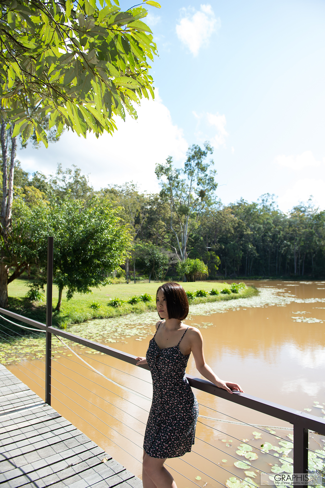
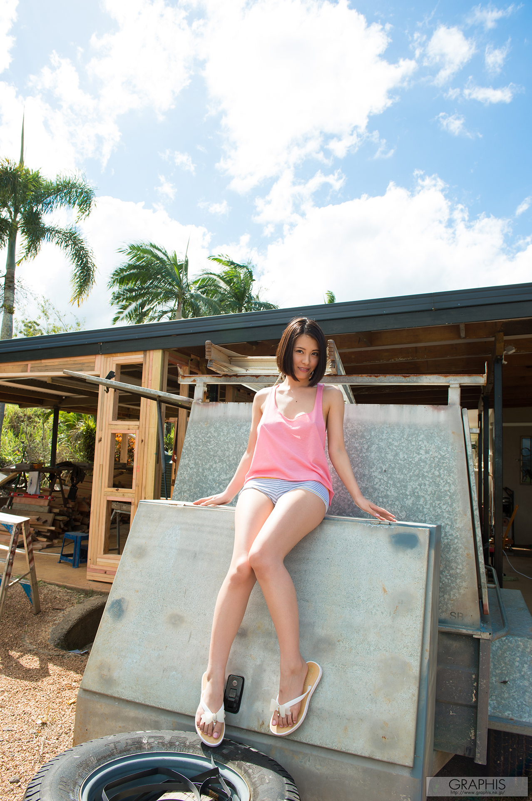
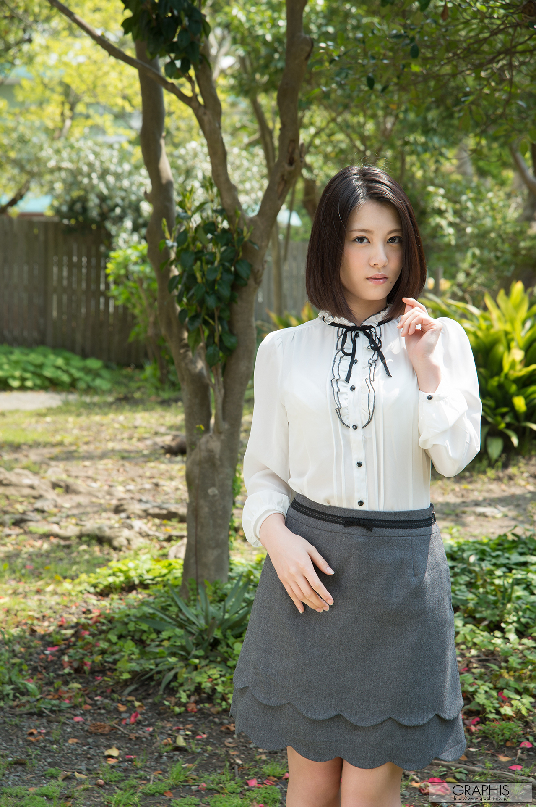

# 松冈千菜

**松冈千菜**（日语：松岡 ちな／まつおか ちな *Matsuoka China*，1994年4月16日－），日本前女优，出身自福冈县，曾隶属经纪公司 BKpromotion。

2016年6月1日，她于自己 Twitter 中表示遇上车祸，以致全身受伤，肇事司机更不顾而去；7月19日也透露内脏感染病毒，并已入院治疗和需长时间休养，至8月15日就以四页纸书信向 SOD Create CO.,LTD. 请辞，宣布正式退出行业。

